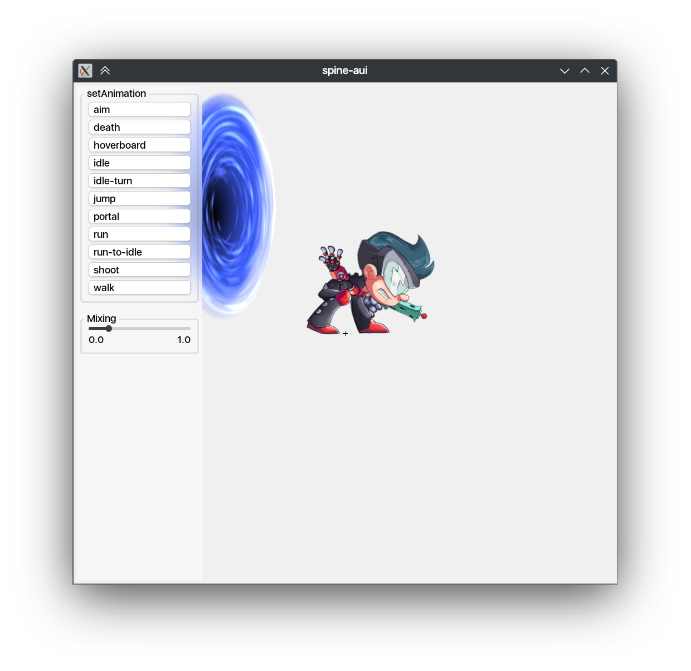

# aui.spine

[Spine](https://esotericsoftware.com/) Runtime integration for [AUI Framework](https://github.com/aui-framework/aui).

> [!CAUTION]
> Integration of Spine Runtime requires a [license](http://esotericsoftware.com/spine-runtimes-license). Please consult
> with these terms before using this module.



# Usage

```cmake
# import AUI - see https://github.com/aui-framework/aui
auib_import(aui https://github.com/aui-framework/aui
            COMPONENTS core views
            VERSION ${AUI_VERSION})

auib_import(aui.spine https://github.com/aui-framework/aui.spine)
```

aui.spine adds `ASpineView` - AUI's `AView` which displays Spine animation.

# Example

See `example` dir.

## Running Example

1. Clone this repo.
2. CMake configure with `-DAUI_SPINE_EXAMPLES=TRUE`
3. Run aui.spine.example
